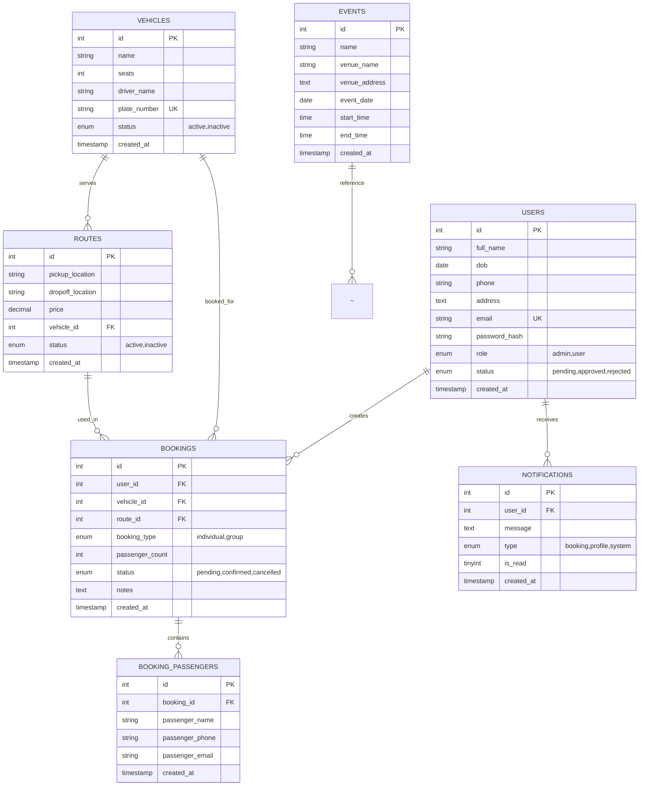

# Coach Services Co. - Entity Relationship Diagram (ERD)

## Database Structure: Brisbane Olympics 2032 Transport Booking System



---

## 📊 Detailed Entity Specifications

### **USERS Table**
| Column | Type | Constraints | Purpose |
|--------|------|-------------|---------|
| id | INT | PK, AUTO_INCREMENT | Unique user identifier |
| full_name | VARCHAR(150) | NOT NULL | User's full name |
| dob | DATE | NULL | Date of birth |
| phone | VARCHAR(20) | NOT NULL | Contact phone number |
| address | TEXT | NULL | User's address |
| email | VARCHAR(100) | UNIQUE, NOT NULL | Email (login credential) |
| password_hash | VARCHAR(255) | NOT NULL | bcryptjs hashed password |
| role | ENUM | DEFAULT 'user' | User type: admin or user |
| status | ENUM | DEFAULT 'pending' | Approval status |
| created_at | TIMESTAMP | AUTO | Account creation timestamp |

**User Roles:**
- `admin` - Full access to management features
- `user` - Can browse, search, and book services

**User Status:**
- `pending` - Awaiting admin approval
- `approved` - Active and can book
- `rejected` - Denied access

---

### **VEHICLES Table**
| Column | Type | Constraints | Purpose |
|--------|------|-------------|---------|
| id | INT | PK, AUTO_INCREMENT | Unique vehicle ID |
| name | VARCHAR(150) | NOT NULL | Coach name/designation |
| seats | INT | NOT NULL | Total seat capacity |
| driver_name | VARCHAR(150) | NOT NULL | Assigned driver name |
| plate_number | VARCHAR(30) | UNIQUE, NOT NULL | Vehicle registration plate |
| status | ENUM | DEFAULT 'active' | Operational status |
| created_at | TIMESTAMP | AUTO | Record creation date |

**Sample Vehicles:**
- Brisbane Express Coach A (48 seats)
- Gold Coast Shuttle B (32 seats)
- Olympic VIP Coach C (24 seats)

---

### **ROUTES Table**
| Column | Type | Constraints | Purpose |
|--------|------|-------------|---------|
| id | INT | PK, AUTO_INCREMENT | Unique route ID |
| pickup_location | VARCHAR(200) | NOT NULL | Starting point |
| dropoff_location | VARCHAR(200) | NOT NULL | Destination |
| price | DECIMAL(10,2) | NOT NULL | Fixed price per route |
| vehicle_id | INT | FK → vehicles.id | Assigned vehicle |
| status | ENUM | DEFAULT 'active' | Route availability |
| created_at | TIMESTAMP | AUTO | Record creation date |

**Sample Routes:**
- Brisbane CBD → Gabba Stadium ($25.00)
- Brisbane CBD → QSAC Nathan ($30.00)
- Brisbane CBD → Suncorp Stadium ($20.00)
- Brisbane CBD → Entertainment Centre ($35.00)

---

### **BOOKINGS Table**
| Column | Type | Constraints | Purpose |
|--------|------|-------------|---------|
| id | INT | PK, AUTO_INCREMENT | Unique booking ID |
| user_id | INT | FK → users.id (CASCADE) | Booking customer |
| vehicle_id | INT | FK → vehicles.id (SET NULL) | Assigned vehicle |
| route_id | INT | FK → routes.id (SET NULL) | Selected route |
| booking_type | ENUM | NOT NULL | individual or group |
| passenger_count | INT | DEFAULT 1 | Number of passengers |
| status | ENUM | DEFAULT 'pending' | Booking approval status |
| notes | TEXT | NULL | Additional notes |
| created_at | TIMESTAMP | AUTO | Booking timestamp |

**Booking Types:**
- `individual` - Single passenger booking
- `group` - Multiple passengers booking

**Booking Status:**
- `pending` - Awaiting admin confirmation
- `confirmed` - Approved and ready
- `cancelled` - Booking cancelled

---

### **BOOKING_PASSENGERS Table**
| Column | Type | Constraints | Purpose |
|--------|------|-------------|---------|
| id | INT | PK, AUTO_INCREMENT | Unique passenger record |
| booking_id | INT | FK → bookings.id (CASCADE) | Associated booking |
| passenger_name | VARCHAR(150) | NOT NULL | Passenger's full name |
| passenger_phone | VARCHAR(20) | NULL | Passenger's phone |
| passenger_email | VARCHAR(100) | NULL | Passenger's email |
| created_at | TIMESTAMP | AUTO | Record creation date |

**Purpose:** Store individual passenger details for group bookings

---

### **NOTIFICATIONS Table**
| Column | Type | Constraints | Purpose |
|--------|------|-------------|---------|
| id | INT | PK, AUTO_INCREMENT | Unique notification ID |
| user_id | INT | FK → users.id (CASCADE) | Recipient user |
| message | TEXT | NOT NULL | Notification content |
| type | ENUM | DEFAULT 'system' | Notification category |
| is_read | TINYINT(1) | DEFAULT 0 | Read status (0/1) |
| created_at | TIMESTAMP | AUTO | Notification timestamp |

**Notification Types:**
- `booking` - Booking status updates
- `profile` - Profile approval/rejection
- `system` - General system messages

---

### **EVENTS Table**
| Column | Type | Constraints | Purpose |
|--------|------|-------------|---------|
| id | INT | PK, AUTO_INCREMENT | Unique event ID |
| name | VARCHAR(200) | NOT NULL | Event name |
| venue_name | VARCHAR(200) | NOT NULL | Venue name |
| venue_address | TEXT | NOT NULL | Venue location |
| event_date | DATE | NOT NULL | Event date |
| start_time | TIME | NOT NULL | Event start time |
| end_time | TIME | NOT NULL | Event end time |
| created_at | TIMESTAMP | AUTO | Record creation date |

**Sample Events:**
- Athletics 100m Final - Gabba Stadium (2032-07-24)
- Swimming Finals Day 1 - Brisbane Aquatics Centre (2032-07-25)
- Rugby Sevens Final - Suncorp Stadium (2032-07-26)
- Opening Ceremony - Brisbane Stadium (2032-07-23)

---

## 🔗 Relationship Details

### **1:N Relationships**

#### USERS → BOOKINGS (One-to-Many)
- One user can create multiple bookings
- Cascade delete: If user deleted, all their bookings are deleted
- Used in: User dashboard to show their booking history

#### USERS → NOTIFICATIONS (One-to-Many)
- One user receives multiple notifications
- Cascade delete: If user deleted, all notifications deleted
- Used in: Bell icon notification system

#### VEHICLES → ROUTES (One-to-Many)
- One vehicle can serve multiple routes
- Set NULL on delete: If vehicle deleted, routes remain but vehicle_id becomes null
- Used in: Route management and vehicle utilization tracking

#### VEHICLES → BOOKINGS (One-to-Many)
- One vehicle can be booked multiple times
- Set NULL on delete: If vehicle deleted, bookings remain but vehicle_id becomes null
- Used in: Booking assignment and capacity management

#### ROUTES → BOOKINGS (One-to-Many)
- One route can have multiple bookings
- Set NULL on delete: If route deleted, bookings remain but route_id becomes null
- Used in: Route popularity and pricing analysis

#### BOOKINGS → BOOKING_PASSENGERS (One-to-Many)
- One booking can have multiple passengers (group bookings)
- Cascade delete: If booking deleted, all passengers deleted
- Used in: Group booking details storage

---

## 🔐 Data Integrity Constraints

### **Unique Constraints (UK)**
- `users.email` - No duplicate email addresses
- `vehicles.plate_number` - Each vehicle has unique registration

### **Foreign Key Constraints (FK)**

| Constraint | Action on Delete | Reason |
|-----------|------------------|--------|
| bookings.user_id → users.id | CASCADE | Delete user = delete their bookings |
| bookings.vehicle_id → vehicles.id | SET NULL | Keep booking record, but remove vehicle link |
| bookings.route_id → routes.id | SET NULL | Keep booking record, but remove route link |
| routes.vehicle_id → vehicles.id | SET NULL | Keep route record, but remove vehicle link |
| booking_passengers.booking_id → bookings.id | CASCADE | Delete booking = delete passenger records |
| notifications.user_id → users.id | CASCADE | Delete user = delete their notifications |

---

## 🎯 Data Flow Scenarios

### **Scenario 1: Individual Booking**
```
1. User registers → USERS (status: pending)
2. Admin approves → USERS.status = approved
3. User searches routes → Query ROUTES + VEHICLES
4. User books → Create BOOKINGS (booking_type: individual, passenger_count: 1)
5. Admin confirms → BOOKINGS.status = confirmed
6. Notification sent → Insert NOTIFICATIONS record
```

### **Scenario 2: Group Booking**
```
1. User submits group booking → Create BOOKINGS (booking_type: group, passenger_count: 5)
2. For each passenger → Insert BOOKING_PASSENGERS records
3. Admin reviews → Can see all passenger details
4. Admin confirms → BOOKINGS.status = confirmed
5. SMS sent to each passenger → Via Twilio (optional)
6. Notifications created → NOTIFICATIONS for each user if needed
```

### **Scenario 3: Profile Approval**
```
1. User requests approval → USERS.status = pending
2. Admin reviews profile → Query USERS table
3. Admin approves/rejects → USERS.status = approved/rejected
4. Notification sent → Insert NOTIFICATIONS record
5. User receives SMS alert → Via Twilio SMS service
```

---

## 📈 Indexing Recommendations

```sql
-- Add for performance optimization
CREATE INDEX idx_users_email ON users(email);
CREATE INDEX idx_users_status ON users(status);
CREATE INDEX idx_bookings_user_id ON bookings(user_id);
CREATE INDEX idx_bookings_vehicle_id ON bookings(vehicle_id);
CREATE INDEX idx_bookings_route_id ON bookings(route_id);
CREATE INDEX idx_bookings_status ON bookings(status);
CREATE INDEX idx_notifications_user_id ON notifications(user_id);
CREATE INDEX idx_notifications_is_read ON notifications(is_read);
CREATE INDEX idx_routes_vehicle_id ON routes(vehicle_id);
CREATE INDEX idx_booking_passengers_booking_id ON booking_passengers(booking_id);
```

---

## 📊 Summary Statistics

| Entity | Purpose | Records | Relationships |
|--------|---------|---------|---------------|
| USERS | User accounts (admin + customers) | ~100-1000 | 2 (Bookings, Notifications) |
| VEHICLES | Coach fleet management | ~5-20 | 2 (Routes, Bookings) |
| ROUTES | Transport routes with pricing | ~20-50 | 2 (Vehicles, Bookings) |
| BOOKINGS | Customer bookings | ~1000s | 4 (Users, Vehicles, Routes, Passengers) |
| BOOKING_PASSENGERS | Passenger details (groups) | ~1000s | 1 (Bookings) |
| NOTIFICATIONS | In-app alerts & messages | ~10000s | 1 (Users) |
| EVENTS | Olympic event schedule | ~30-100 | 0 (Reference only) |

